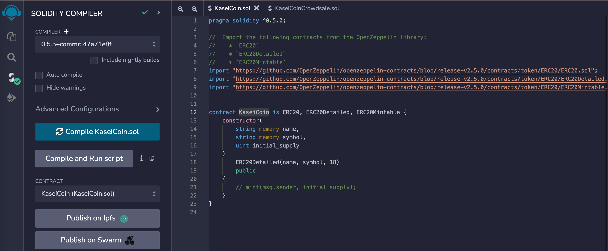
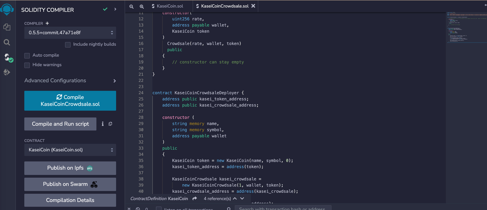
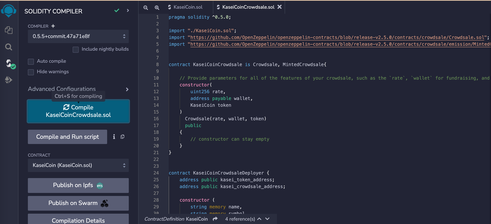
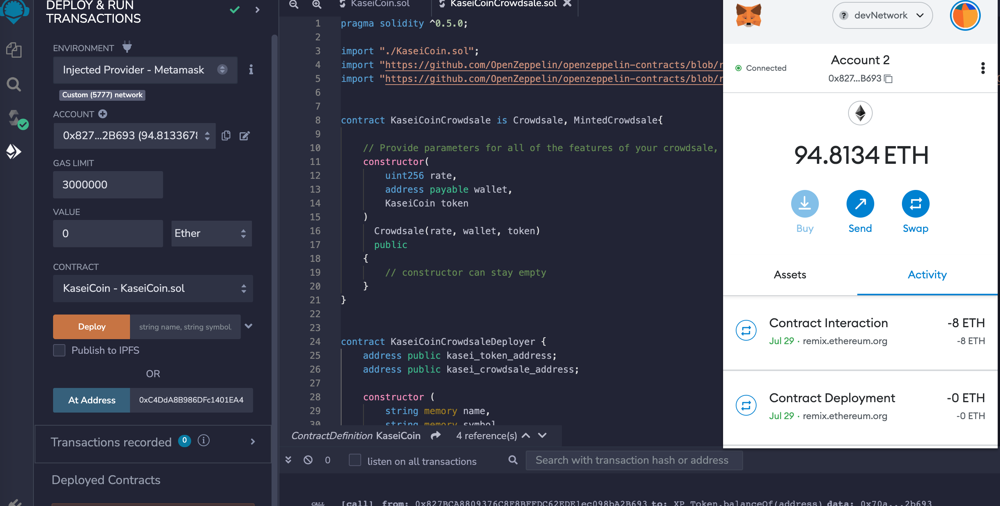
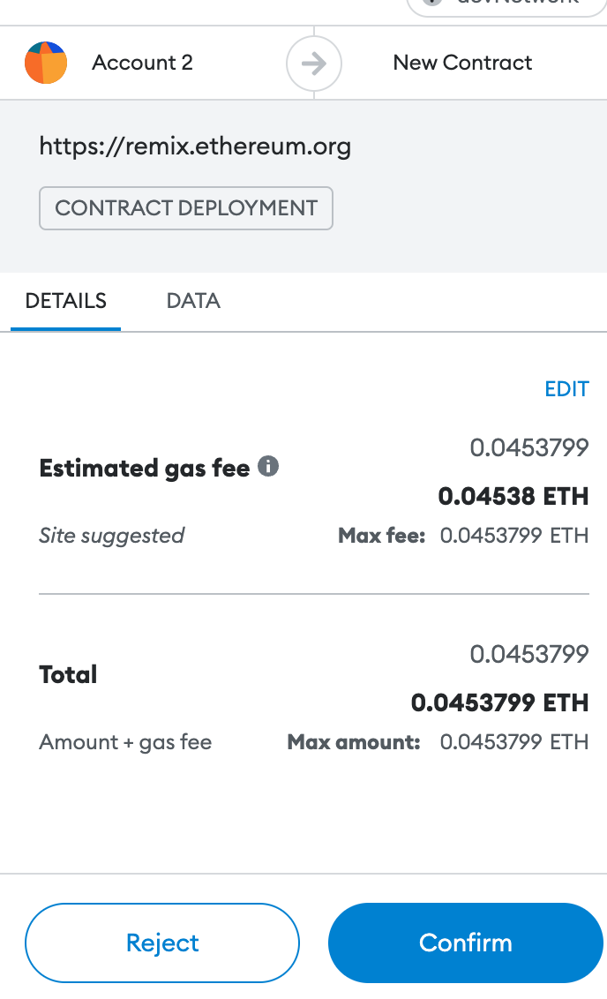
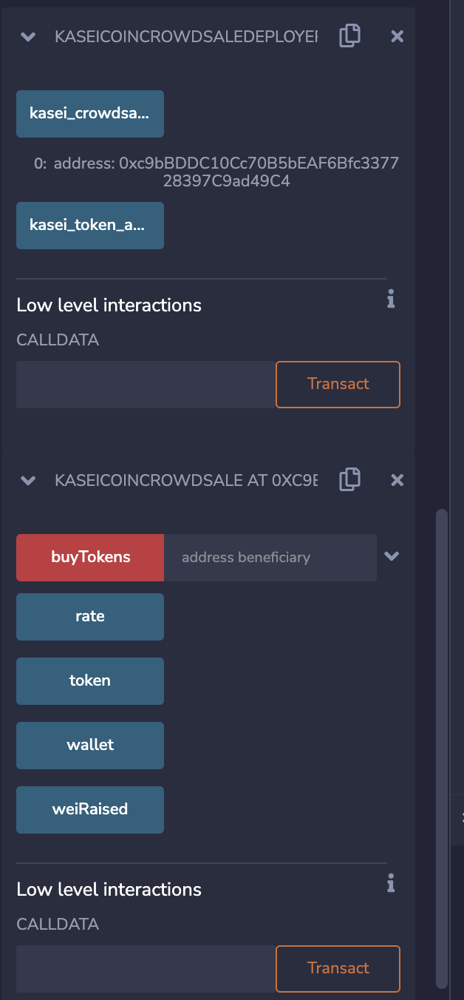
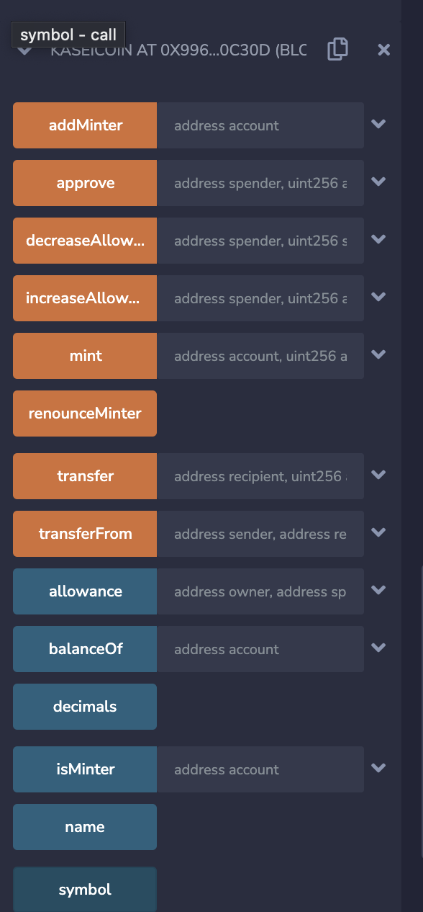
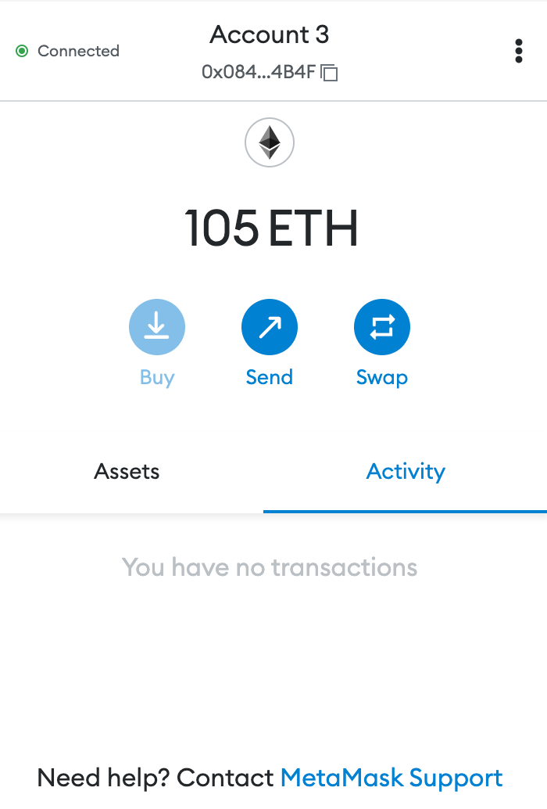
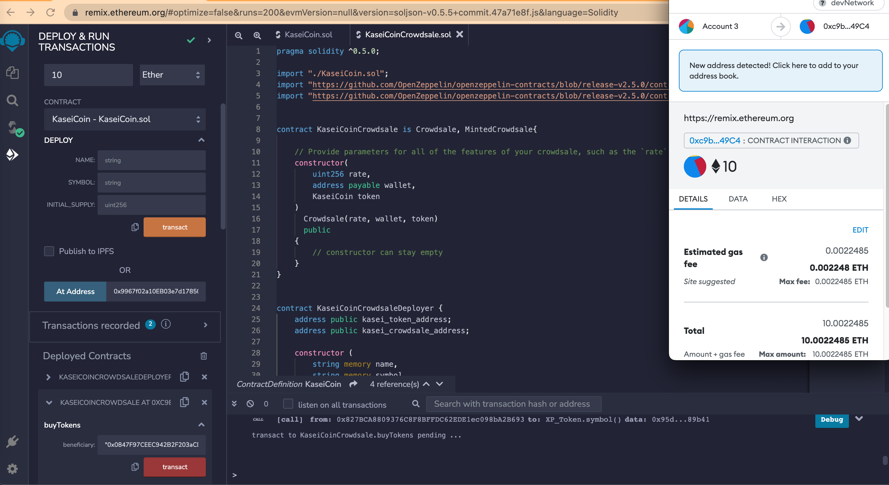
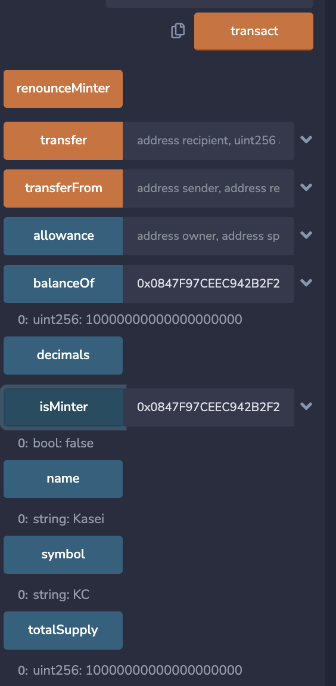

1.Once we compiled KasieCoin

2.CrowdSale Compilation

3.CrowdSale Deployer Compilation

4.Metamask confirmation

5.Metamask connected 

6.Kasei deployment crowdsale

7.Kasei Deployment Sale

8.Kasei Switched Account

9.Kasei coins purchase

10.Kasei coins purchase

